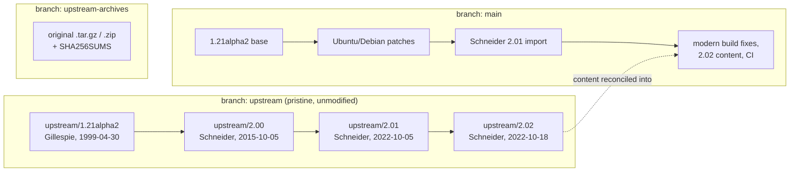

# p2c: Pascal to C Translator

[](https://github.com/FranklinChen/p2c/actions/workflows/ci.yml)

**p2c** translates Pascal source into C. It was written by Dave Gillespie
(1989-1993), copyright Free Software Foundation, and distributed under the GPL.
The generated C code and the runtime library (`p2clib.c`, `p2c.h`) are **not**
GPL-restricted, so you may ship translated code under any license you like.

This repository preserves the complete surviving p2c lineage in version control
and keeps it building and passing tests on current compilers.

## Which p2c do you want?

| If you want to... | Use |
|---|---|
| **Run** Pascal code today | [Free Pascal](https://www.freepascal.org/). Tom Schneider, p2c's last maintainer, uses it now. p2c is a translator, not a compiler, and Free Pascal is actively developed. |
| Read or fetch **upstream p2c sources** | [`https://alum.mit.edu/www/toms/p2c/`](https://alum.mit.edu/www/toms/p2c/), Schneider's canonical address. He repoints it whenever hosting moves, so prefer it to any direct host. |
| A p2c that **builds and is tested** on current toolchains | This repository. |
| **C source output** from Pascal, for embedding in a C project | This repository, and see the recipe below. |

p2c is not actively developed by anyone. Gillespie stopped in 1993 and
Schneider stopped after 2.02 in 2022. This repository is maintained to the
extent of keeping it correct, buildable, and honestly documented.

## Supported dialects

- HP Pascal
- Turbo/UCSD Pascal (including Turbo Pascal 6.0 OOP)
- DEC VAX Pascal
- Oregon Software Pascal/2
- Macintosh Programmer's Workshop Pascal (including Object Pascal)
- Sun/Berkeley Pascal
- Texas Instruments Pascal
- Apollo Domain Pascal
- Partial Modula-2 support

See the original [`README`](README) for Gillespie's installation instructions.

---

## Building

Requires `make`, a C compiler, and `perl`. `nroff` is used if present and
skipped if not.

```bash
make test       # build p2c, install into home/, translate and run the examples
make install    # build and install into home/ only
```

The build produces `p2c` in the repository root, `home/libp2c.a`, and
`home/p2c/p2c.h`.

## Translating a program

```bash
./p2c myfile.p
cc -Ihome myfile.c home/libp2c.a -o myfile
```

### Generating C that current compilers accept

**This is the part most people need and it is not the default.** Out of the
box, p2c emits K&R C with a bare `main(argc, argv)`, and implicit `int` return
types have been invalid C since C99. That output will not compile on a current
toolchain without suppression flags.

Two settings fix it at the source:

```bash
# in a p2crc file next to your Pascal source
MainType	int
```
```bash
./p2c -a myfile.p
cc -std=c23 -Ihome myfile.c home/libp2c.a -o myfile
```

- `-a` emits ANSI prototypes instead of K&R parameter lists. It is documented
  in the man page as an override for the `AnsiC` setting.
- `MainType int` gives `main` a return type. It is documented in `src/sys.p2crc`
  and nowhere else, which is a single line inside an 83KB file, so essentially
  nobody finds it.
- `UseGets 0` is needed if your program reads strings. By default p2c emits
  `gets()`, which C11 removed and glibc no longer declares, so the output will
  not compile on Linux at all. Setting it to 0 uses `fgets` with a length
  check, which is both compilable and not the textbook buffer-overflow
  function. macOS still declares `gets`, so this one hides on a Mac.

Together they produce output that compiles under strict `-std=c23
-pedantic-errors`. `scripts/check-c23-output.sh` verifies exactly this in CI,
against Apple clang and GCC, and checks that the resulting programs run and
produce correct results.

Note the distinction, because it is why default output can look fine today and
break tomorrow. GCC 16 defaults to `gnu23`, which still accepts K&R function
definitions as a GNU extension, and Apple clang 21 still defaults to C17. Strict
ISO C23 accepts neither. If you want output that survives a compiler default
moving, use the recipe above.

### Modern compiler compatibility

The tree builds clean with **no warning-suppression flags anywhere**. Each row
below was verified 2026-08-25 by running `make check` end to end: build p2c,
translate the examples, compile that output as strict C23, link it, and run it.

| Compiler | Platform | C23 flag | Result |
|---|---|---|---|
| Apple clang 21.0.0 | macOS 26 | `-std=c23` | 5/5 checks pass |
| GCC 13.3.0 | Ubuntu 24.04 | `-std=c2x` | 5/5 checks pass |
| GCC 15.3.0 | Debian (`gcc:15`) | `-std=c23` | 5/5 checks pass |
| GCC 16.2.0 | Debian (`gcc:16`) | `-std=c23` | 5/5 checks pass |

GCC 13 and Clang 15/16 know the standard only by its draft name `c2x`;
`scripts/check-c23-output.sh` accepts either spelling and fails only if the
compiler supports neither.

`src/Makefile` sets `-std=gnu17`. This is not suppression: p2c's sources are
C17-era code that uses unspecified-parameter declarations, `f()`, which C23
redefines to mean `f(void)`. Selecting the dialect states the language the code
is actually written in.

Without it, compilers that default to C23 (GCC 15 and later) fail with **169
errors** across `parse.c`, `decl.c`, `funcs.c`, `pexpr.c` and `citmods.c`,
essentially all of them function-pointer signature mismatches. p2c keeps five
differently-shaped handler functions in a single `Expr *(*handler)()` field in
`trans.h` and relies on the pre-C23 meaning of `()` to do it.

`-std=gnu17` requires GCC 8+ or Clang 6+. Remove it if you build with something
older. The underlying design is not fixed, only accommodated: a real repair
would give those 313 handler registrations distinct types.

Removing the old `-Wno-implicit-function-declaration` flag exposed two real
defects it had been hiding, both Linux-only. See the table below; neither
reproduces on macOS, which is why the flag looked vestigial there.

---

## Repository layout

The pristine upstream releases are preserved on their own branches, so that any
question of the form "what did upstream actually change?" is a `git diff`
rather than an archaeology project.



| Branch | Contents |
|---|---|
| `main` | The working tree: upstream plus Debian patches plus build fixes. |
| `upstream` | Unmodified contents of each upstream release, one commit each, tagged `upstream/<version>`. |
| `upstream-archives` | The original distribution archives bit-exact, with `SHA256SUMS`. |
| `ubuntu` | The Ubuntu 1.21alpha2-3 packaging, imported in 2017. |

Useful consequences:

```bash
git diff upstream/2.01 upstream/2.02   # exactly what Schneider changed in 2.02
git diff upstream/2.02 main            # exactly what this fork adds
```

Every release archive p2c ever had is currently served from a single host. Every
previous distribution point has gone dark, including Caltech's original FTP site
and `schneider.ncifcrf.gov`. That is why the archives are committed here.

---

## History

### Gillespie, 1989-1993

p2c was written by **Dave Gillespie** (c/o Synaptics) and was listed as a
[GNU project](https://www.gnu.org/software/p2c/) (that URL now redirects to a
2006 Wayback Machine snapshot). The original distribution site was
`csvax.cs.caltech.edu`, long dead. `src/HISTORY` tracks 22 versions from 1.00 to
1.21alpha. His final release was **1.21alpha-07.Dec.93**.

### Schneider, 2015-2022

**Tom Schneider**, a researcher at NIH/NCI Frederick, picked p2c up two decades
later and published **2.00**, **2.01**, and **2.02**. All three were portability
work; none of them changed how p2c translates.

- **2.00** (2015-10-05) renamed symbols that collide with modern libc:
  `logf` to `logfile`, `getline` to `getaline`, and added `-DTEST_MALLOC`.
  This is also the release that set `P2C_VERSION` to `"2.00.Oct.15"`, where it
  has remained ever since, including in 2.02.
- **2.01** (2022-10-05) made small changes to `lex.c`, `parse.c`, `out.c` and
  `comment.c`. **This release shipped a broken `src/p2c.h`**: it declared the
  VAX helpers as bare K&R definition headers, `Void VAXdate(s)` with no
  parameter declarations, no body and no semicolon. That header does not
  compile, so no program built against the 2.01 runtime could be compiled at
  all. If you are packaging 2.01, patch or replace `p2c.h`.
- **2.02** (2022-10-18) fixed that header, adding proper `VAXdate` and
  `VAXtime` prototypes, and adjusted `p2clib.c` and `makeproto.c`.

Schneider has since moved to Free Pascal.

A **1.22** release is sometimes attributed to Schneider and is packaged by some
distributions, but it appears in neither his own archive index nor `src/HISTORY`,
and is unverified here.

### Version timeline

| Version | Date | Author | Notes |
|---------|------|--------|-------|
| 1.00 | ~1989 | Gillespie | Initial release |
| ... | 1989-1993 | Gillespie | 22 releases adding dialect support |
| 1.20 | ~1992 | Gillespie | Last "stable" release |
| 1.21alpha2 | 1993-12-07 | Gillespie | Final Gillespie release |
| 1.22 | unknown | attributed to Schneider | **Unverified**, see above |
| 2.00 | 2015-10-05 | Schneider | `logf`/`getline` renames, `-DTEST_MALLOC` |
| 2.01 | 2022-10-05 | Schneider | Small lexer/parser fixes; **ships a `p2c.h` that does not compile** |
| 2.02 | 2022-10-18 | Schneider | Fixes that header; final release |

### This fork

Assembled from:

1. **Gillespie's 1.21alpha2** base
2. **Ubuntu/Debian patches** from `p2c_1.21alpha2-3.diff.gz` (Debian bugs
   [#305412](https://bugs.debian.org/305412),
   [#552828](https://bugs.debian.org/552828), the built-in `logf` conflict, and
   a manpage fix)
3. **Schneider's 2.01** imported via PR #1 in 2017. Note that this import did
   not include `src/p2c.h`, which by luck is why this fork never carried 2.01's
   broken header.
4. **Schneider's 2.02** content, reconciled: the `VAXdate`/`VAXtime` prototypes
   were taken, while this fork's own cleaner fixes for `p2clib.c` and
   `makeproto.c` were kept over upstream's.
5. **Modern build support**: `-std=gnu17`, removal of all suppression flags, a
   C23 fix for `true`/`false` in `p2c.h`, and CI covering GCC 15 and 16.

---

## Defects downstreams were patching privately

Several projects carried private patches for the same p2c defects, which is
worth recording because it shows what an absent upstream costs: the same bug
found and fixed three times, in three trees, by people who never spoke to each
other. **All of these are now fixed here**, so if you package p2c you should be
able to drop the corresponding patches.

| Defect | Also patched by | Fixed here by |
|---|---|---|
| `_OutMem` returned `int` and the `Malloc` macro casts it to a pointer, truncating on LP64. 24 warnings in a clean build of the examples. | M-Tx (Bob Tennent), AUR (Chris Severance) | Widening the return type to `intptr_t`, following the AUR. Tennent's fix casts through `size_t` at the call site, which hides the truncation rather than removing it. |
| `main` emitted with no return type, invalid C since C99 | AUR (patches `sys.p2crc` globally) | `MainType int` in `examples/p2crc`, keeping the global default unchanged for existing downstreams |
| `my_memcpy` used before declaration | Schneider in 2.02, M-Tx | A forward declaration in `p2clib.c`, inside the include guard, unlike 2.02's |
| `trans.h` declared `link`/`unlink`, conflicting with the const-qualified POSIX ones | AUR | Including `<unistd.h>` and deleting p2c's own declarations |
| `#define Char char` where a typedef belongs | M-Tx | `typedef char Char;`, guarded so `-DChar=` still overrides |
| `trans.c` called `sbrk()` undeclared, so p2c did not build on Linux at all under GCC 14+ | AUR | Same `<unistd.h>` include |
| p2c emitted `gets()`, removed in C11 and undeclared by glibc | (not seen elsewhere) | `UseGets 0` in `examples/p2crc`, which uses `fgets` with a length check |

The last two do not reproduce on macOS, which is why they survived so long in a
tree whose maintainer worked on a Mac.

---

## Distribution packaging

Verified 2026-08-25 where marked; the remaining rows are from March 2026
research and have not been re-checked.

| Distribution | Version | Status |
|---|---|---|
| **AUR (Arch Linux)** | 2.02 | Verified active, updated 2025-11-28. Carries 7 patches. |
| **GNU Guix** | 2.02 | Uses `-Wno-implicit-function-declaration`. |
| **Slackware current** | 2.02 | Development branch. |
| **Slackware 15.0** | 2.01 | Stable. Note the 2.01 header problem above. |
| **Mageia Cauldron** | 2.02 | Development. |
| **Mageia 9** | 1.22 | Stable. |
| **PLD Linux** | 1.22 | RPM spec. |
| **pkgsrc (NetBSD)** | 1.20nb1 | Still points at the dead Caltech FTP site. |
| **FreeBSD ports** | 2.01 | **Deleted** 2019, "BROKEN: unfetchable". |
| **Debian** | none | Removed ~2010. RFP [#895637](https://bugs.debian.org/895637) open since 2018. |
| **Homebrew** | none | Not packaged. |

Distributions packaging 2.02 fetch from `users.fred.net`, which is live.

---

## Real-world usage

- **[M-Tx](https://ctan.org/pkg/m-tx)** (Music from TeXt), a preprocessor for
  PMX and MusiXTeX. Its Pascal sources are translated to C with p2c for
  inclusion in TeX Live, which accepts only C and Lua. Maintainer Bob Tennent
  cites this dependency in Debian RFP #895637, which lists this repository as
  one of three sources for p2c. The other two are now dead.

## Related projects

| Project | Notes |
|---------|-------|
| [Classic-Tools/p2c](https://github.com/Classic-Tools/p2c) | Historical archive of Gillespie releases. Archived, read-only. |
| [djipi/p2c](https://github.com/djipi/p2c) | 1.21alpha2 with claimed Win32 support. |
| [knizhnik/ptoc](https://github.com/knizhnik/ptoc) | Independent Pascal to C++ converter, unrelated to p2c. |
| [Free Pascal](https://www.freepascal.org/) | A full Pascal compiler, not a translator. |

## Known source URLs

Checked 2026-08-25.

| URL | Status |
|-----|--------|
| [`https://alum.mit.edu/www/toms/p2c/`](https://alum.mit.edu/www/toms/p2c/) | **Live, canonical.** Returns 403 to command-line fetchers because of a bot filter; use a browser. |
| `http://users.fred.net/tds/lab/p2c/` | **Live.** Currently the host behind the canonical address. |
| `https://schneider.ncifcrf.gov/p2c/` | Dead. Does not resolve. |
| `ftp://csvax.cs.caltech.edu/pub/p2c-1.20.tar.Z` | Dead since the 1990s. |

---

## Scripts

| Script | Purpose |
|---|---|
| `scripts/check-c23-output.sh` | Verify generated C is valid strict ISO C23, links, and runs correctly. Run after `make test`. |

## License

p2c is distributed under the [GNU General Public License](src/COPYING). The
generated C code and the runtime files (`p2clib.c`, `p2c.h`) are **not**
restricted by the GPL.

---

*Last verified against Apple clang 21 and GCC 16 on 2026-08-25.*
